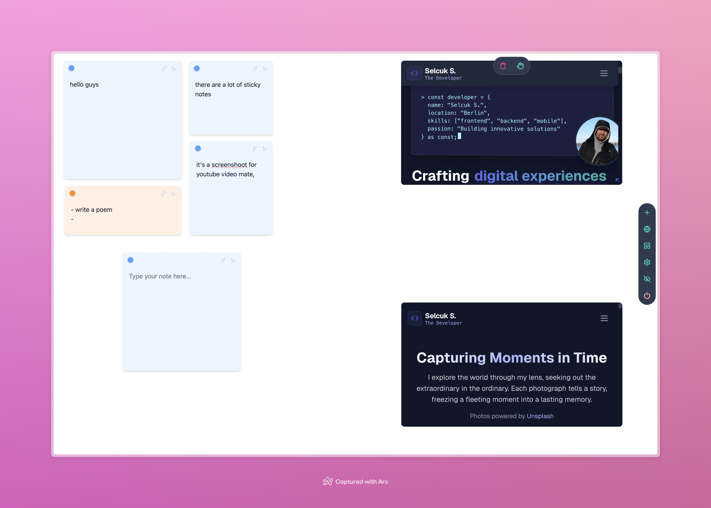

## taulu

**A minimalist board application**

taulu is a board application that allows you to take quick notes and keep your most frequently used websites constantly
on screen. It will be released for macOS for now, and later distributed for Windows and Linux.

**Quick Access**: Press `cmd + t` to open or hide the app

**Add Website**: Press `cmd + .` to add a website quickly on the screen

#### Key Features

- **Add a website**: Add a website quickly on the screen
- **Add a sticky note**: Add a sticky note on the screen
- **Cross-platform**: Available on macOS (coming soon for Windows, Linux)
